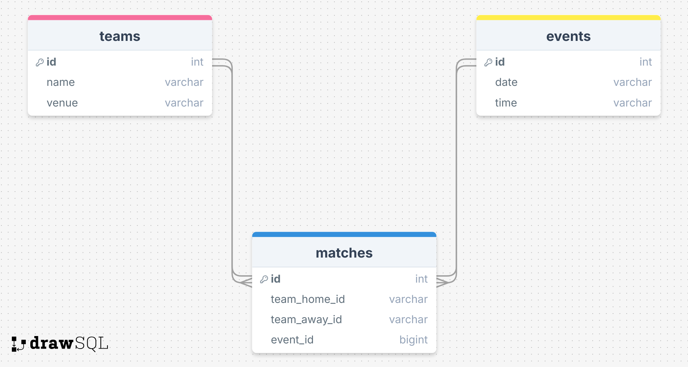

# Sports Event Calendar

With this node.js app the goal was to focus on studying web architecture and data transfer without the usage of frameworks or libraries potentially easing backend data processing (e.g. Express).

# Deliverables

## 1. Database schema for Postgres

### Ensuring compliance with 3NF resolving m:n relationship between teams and events:

- Resolving adding table 'matches' to schema
- One team can take part in multiple matches
- One event date can be assigned to multiple matches
- Foreign keys will be added to matches for team_home_id and team_away_id column REFERENCING table 'teams' primary key column 'id' providing access to all other values within the corresponding row

## 2. Connecting database (Postgres)

For prototyping reasons this App was created based on in-memory storage first. As for now the App can be run directly on localhost:3000.

Localhost:3000 will load the event display site.
Localhost:3000/admin will lead to the admin-ui for posting new events.

The in-memory database is pre-populated providing sample events and teams.

## 3. App

The main focus was given on learning and understanding an app architecture, especially the server set-up, routing, data formats and data transfer between backend and frontend.

For learning purposes frameworks were avoided focusing on pure Javascript and the underlying web architecture.
